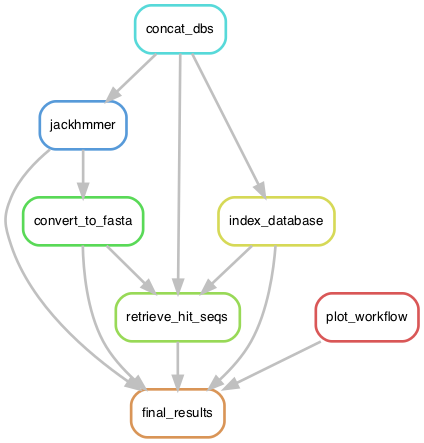

# JackHMMerer

This is a snakemake workflow for searching iteratively for similar sequences in
amino acid sequence FASTA files using the jackhmmer program from the [HMMer3
software package](http://hmmer.org/).

## Overview

<p align="center">

</p>


## Installation 

- Clone the code repository from github to your computer by running the
  following shell command in your terminal:
  ```
  git clone https://github.com/laelbarlow/jackhmmerer.git
  ```

- Change directories into the cloned repository:
  ```
  cd jackhmmerer
  ```

- Install jackhmmerer (set up snakemake environment and profile for submitting
  jobs via your cluster's job scheduler), and run a test job.
  ```
  make install
  make dry_run
  ```

## Procedure

- Put amino acid sequence FASTA files with sequences to be searched in the
  `resources/FASTA_Databases` directory.

- Assign each FASTA file to a taxonomic group (*e.g.*, Eukaryotes, Archaea, or
  Bacteria) in a file `resources/genome_ids_by_taxon.csv`, wherein the first
  column is the taxonomic group name and the second column is a genome
  identifier (*e.g.*, a EukProt ID).

- Put amino acid sequence FASTA files with sequences to be used as jackhmmer
  queries in the `resources/FASTA_Queries` directory. If any of these sequences
  contain more than one domain, they should be trimmed to include only the
  domain of interest.

- If necessary, customize the list of E-value thresholds (for the best domain
  in a sequence) to use for jackhmmer runs (the workflow will run the jackhmmer
  separately for each of the listed E-value thresholds).
  ```
  vim resources/evalue_thresholds.csv
  ```

- Run the workflow.
  ```
  make run
  ```

- View results. The alignments in this directory may be of particular interest:
  `results/convert_to_fasta`. **Important:** The output FASTA sequence files do
  not contain full-length sequences, they are only the subsequences that
  matched the query sequence.


## License

MIT License

Copyright (c) 2021 Lael D. Barlow

Permission is hereby granted, free of charge, to any person obtaining a copy
of this software and associated documentation files (the "Software"), to deal
in the Software without restriction, including without limitation the rights
to use, copy, modify, merge, publish, distribute, sublicense, and/or sell
copies of the Software, and to permit persons to whom the Software is
furnished to do so, subject to the following conditions:

The above copyright notice and this permission notice shall be included in all
copies or substantial portions of the Software.

THE SOFTWARE IS PROVIDED "AS IS", WITHOUT WARRANTY OF ANY KIND, EXPRESS OR
IMPLIED, INCLUDING BUT NOT LIMITED TO THE WARRANTIES OF MERCHANTABILITY,
FITNESS FOR A PARTICULAR PURPOSE AND NONINFRINGEMENT. IN NO EVENT SHALL THE
AUTHORS OR COPYRIGHT HOLDERS BE LIABLE FOR ANY CLAIM, DAMAGES OR OTHER
LIABILITY, WHETHER IN AN ACTION OF CONTRACT, TORT OR OTHERWISE, ARISING FROM,
OUT OF OR IN CONNECTION WITH THE SOFTWARE OR THE USE OR OTHER DEALINGS IN THE
SOFTWARE.


